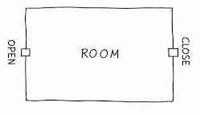
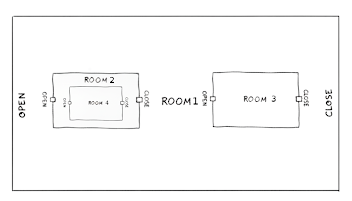

# Problema 25.04: Movimentação de Robô

**Autores:** Marcos Bião e Laís Salvador  
**Data:** 06 de novembro de 2025  

## 1. Introdução

A empresa **SyntaxCorp**, referência em robótica aplicada à exploração de ambientes simbólicos, está desenvolvendo o robô **SYN-1**. Diferentemente de robôs que operam em quaisquer espaços físicos, o SYN-1 navega por **salas especiais aninhadas**, onde cada sala pode conter outras salas internamente.

Essas salas são delimitadas por **portas de entrada e saída**, representadas por:

OPEN Room CLOSE

Para funcionar corretamente, o robô precisa que a estrutura dessas portas esteja **bem formada**, garantindo que cada sala aberta seja devidamente fechada e **na ordem correta**.

### Ambiente Interno das Salas

Além das salas e suas portas, cada ambiente interno pode conter elementos que o robô deve interpretar:

#### Marcas de Energia (representação dos números inteiros)

Durante a navegação, o SYN-1 identifica no chão algumas **marcas de energia**, que representam valores numéricos que ele deve registrar.  
Essas marcas são codificadas como **sequências de dígitos**, por exemplo:

- `7`
- `42`
- `105`

#### Conectores de Fluxo (representação dos operadores aritméticos)

Entre as marcas de energia, o robô encontra **conectores de fluxo**, que indicam como as energias devem ser combinadas:

- `+` → conector de soma  
- `-` → conector de subtração  
- `*` → conector de multiplicação  
- `/` → conector de divisão  

Esses conectores instruem o robô a realizar operações entre **duas marcas de energia**.

O processamento do SYN-1 **apenas ocorre** se a expressão geral for coerente tanto:

- **estruturalmente** (portas bem formadas); quanto  
- **operacionalmente** (sequência válida de marcas de energia e conectores).

## 2. Produto

A equipe de engenharia tem recebido **relatórios de falhas** indicando que o SYN-1 está ficando preso dentro de salas ou processando combinações inválidas de energia. Isso ocorre porque o módulo que gera as sequências de portas, marcas de energia e conectores está enviando **estruturas mal formadas**.

### Exemplos

- ✅ **Correto:**  
OPEN 7 + 3 CLOSE

O robô entra na sala, encontra as marcas de energia `7` e `3`, ligadas por um conector de soma, e sai sem problemas.

- ❌ **Incorreto:**  
OPEN 7+ - 3 CLOSE

Há dois conectores consecutivos; o robô não sabe como interpretar essa combinação.

- ✅ **Correto:**  
OPEN OPEN OPEN 10 * 2 CLOSE CLOSE CLOSE

Todas as portas são corretamente abertas e fechadas, e os conectores seguem uma lógica válida.

- ❌ **Incorreto:**  
OPEN OPEN OPEN CLOSE CLOSE

Falta uma porta de saída, deixando o robô preso no ambiente.

- ✅ **Correto:**  
OPEN 3 - 2 CLOSE * OPEN 4 / 2 CLOSE

Todas as portas são corretamente abertas e fechadas, e os conectores seguem uma lógica válida.

Para evitar panes, a **SyntaxCorp** solicita que sua equipe desenvolva um **validador automático** que verifique previamente se as sequências enviadas ao robô são válidas.

### Desafio

Além de verificar se as sequências apresentadas estão corretas, a SyntaxCorp solicita que seja apresentado **ao final o resultado da conexão da energia**, pois o SYN-1 tem como objetivo percorrer as salas aninhadas e mostrar, ao final da navegação, o **saldo de energia**.

## 3. Conhecimentos / Conceitos Envolvidos

Você e seu grupo deverão:

1. Construir um **analisador léxico (scanner)** capaz de identificar os tokens:
    - portas de entrada/saída (`OPEN`, `CLOSE`);
    - marcas de energia (inteiros);
    - conectores de fluxo (`+`, `-`, `*`, `/`);
    - espaços e outros caracteres relevantes.

2. Implementar um **validador sintático** que detecte:
    - balanceamento correto das portas;
    - ordem correta de abertura e fechamento;
    - sequência válida entre marcas de energia e conectores;
    - presença de símbolos inválidos ou ordem semântica incorreta.

3. Gerar um **relatório automático** informando:
    - se a expressão é válida;
    - em caso de erro: **local**, **tipo** e **justificativa**.

## 4. Objetivos de Aprendizagem

### 4.1 Objetivo Geral

Capacitar o estudante a aplicar os **fundamentos teóricos de Linguagens Formais e Autômatos** na concepção e implementação de um **analisador léxico-sintático completo**.

### 4.2 Objetivos Específicos

- Implementar um **analisador léxico (scanner)** capaz de discernir e classificar corretamente os diferentes componentes da linguagem.  
- Projetar e implementar um **analisador sintático (parser)** para verificar se a sequência de tokens obedece à gramática da “linguagem do robô”.  
- Implementar um **sistema de relatório de falhas**.  
- Estender a análise para além da **sintaxe** (a forma) e adentrar na **semântica** (o significado).

## Referências

RAMOS, M. V. M.; JOSE NETO, J.; VEGA, I. S.  
*Linguagens Formais: Teoria, Modelagem e Implementação.* Editora Bookman, 2009.

MENEZES, Paulo Blauth.  
*Linguagens formais e autômatos.* 6. ed. Bookman, 2011.

LOUDEN, Kenneth C.  
*Compiladores: princípios e práticas.* São Paulo: Thomson Pioneira, 2004.
