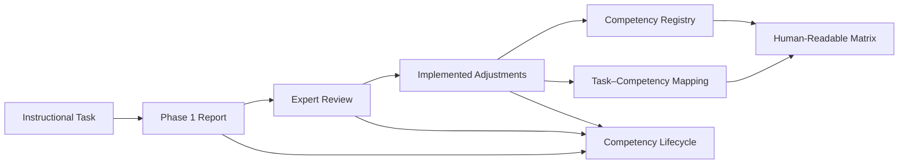

# CSP Cycle 1

## Overview

Cycle 1 records the first application of the Competency Specification Process (CSP) to five Problem-Based Learning tasks in Formal Languages and Automata.

- **Period:** 2021
- **Tasks:** 5
- **Language of task artifacts:** English
- **Instructional approach:** Problem-Based Learning
- **Primary domain:** Formal Languages, Automata, and Models of Computation
- **Competencies in the repository:** 17
- **Current task–competency relationships:** 26
- **Current reuse relationships:** 9
- **Current reuse rate:** 34.6%

## Tasks

| Task | Title | Primary computational model |
| --- | --- | --- |
| Task01 | The Vending Machine for Sodas and Snacks | Finite State Machines |
| Task02 | Traffic Control | Turing Machines |
| Task03 | The Farmer Robot | Finite State Machines |
| Task04 | The Return of the Farmer Robot | Pushdown Automata |
| Task05 | The Farmer Robot and the Feeder Robot | Turing Machines |

## Cycle-Level Artifacts

| Artifact | Purpose |
| --- | --- |
| `CSP-Competency-Registry.csv` | Canonical record of the competencies, their origin, current specification, and usage counts. |
| `CSP-Task-Competency-Mapping.csv` | Canonical record of each task–competency relationship, including creation, reuse, iteration, and evidence files. |
| `CSP-Competency-Lifecycle.csv` | Event history for creation, revision, renaming, reuse, and replacement in a task. |
| `CSP-Competency-Task-Matrix.md` | Human-readable overview of creation and reuse across the five tasks. |
| `CSP-Data-Dictionary.md` | Definitions of fields and controlled values used in the cycle-level datasets. |

## Source-of-Truth Model

The cycle uses three complementary datasets:

1. **Registry:** one row per competency.
2. **Mapping:** one row per task–competency relationship.
3. **Lifecycle:** one row per competency event.

The registry answers *what competencies exist*. The mapping answers *where they are used*. The lifecycle answers *how they changed*. The matrix is a derived reading aid and should not be edited independently of the canonical CSV files.

## Directory Structure

```text
cycle-01/
├── README.md
├── CSP-Competency-Registry.csv
├── CSP-Task-Competency-Mapping.csv
├── CSP-Competency-Lifecycle.csv
├── CSP-Competency-Task-Matrix.md
├── CSP-Data-Dictionary.md
└── en/
    ├── Task01/
    ├── Task02/
    ├── Task03/
    ├── Task04/
    └── Task05/
```

Each task directory contains the instructional task and its CSP artifacts. Depending on the task, these include:

- CSP Phase 1 report;
- expert review report;
- adjustments report;
- additional review iteration.

## CSP Artifact Flow



## Competency Creation and Reuse

| Task | Created | Reused | Total | Reuse rate |
| --- | ---: | ---: | ---: | ---: |
| Task01 | 5 | 1 | 6 | 16.7% |
| Task02 | 4 | 1 | 5 | 20% |
| Task03 | 2 | 3 | 5 | 60% |
| Task04 | 3 | 2 | 5 | 40% |
| Task05 | 3 | 2 | 5 | 40% |
| **Cycle 1** | **17** | **9** | **26** | **34.6%** |

These totals describe current task associations. Cycle 1 contains 17 unique competencies and 26 current associations because the second Task01 iteration added C06 while retaining C01. Task05 formalized three derived competencies through additive specialization.

## Key Historical Decisions

### Task01 second iteration

Task01 originally used C01 — *Develop Problem Solutions Using Automata*. After C06 — *Develop Problem-Solving Solutions Using Finite State Machines* — was created in Task03, the second Task01 iteration added C06 because it represents the finite-state scope more precisely.

The authors defined this as an additive refinement. C01 remains unchanged and associated with Task01; C06 is a reused, more specific competency. The datasets therefore include both associations in the current analysis.

### C04 refinement

C04 was created in Task01 and refined before reuse in Task03. Its identifier and origin remain unchanged. The mapping records `reuse_mode=revised_definition`.

### Task03 review

The grammar-classification competency proposed in the original Task03 specification was removed from the revised set because the task did not exercise it. It does not have an identifier in the final registry and is therefore absent from the cycle-level datasets.

### Task04 terminology

Task04 establishes Pushdown Automata and context-free formalisms as the basis for the return-navigation problem. Finite Automata and regular formalisms remain only where an explicit comparison is required.

### Task05 additive specialization

Task05 initially reused C07–C10 and C05. The expert review identified an expanded cognitive and contextual scope for C07–C09. The adjustments report preserved those base competencies and formalized three additive specializations:

- C07.01, derived from C07;
- C08.01, derived from C08;
- C09.01, derived from C09.

The current Task05 set therefore contains C07.01, C08.01, C09.01, reused C10, and reused C05. The base-competency reuse events remain in the lifecycle and mapping history to preserve the authors' documented process.

## Controlled Interpretation Rules

- A competency is **created** only in its origin task.
- A competency is **reused** when a different task uses an existing competency.
- A revised definition does not change the competency origin.
- Contextual variation does not create a new competency identity.
- A documented specialization creates a derived competency while preserving its relation to the base competency.
- A historical association remains in the mapping with `include_in_current_analysis=false`.
- Empty event dates mean that the source artifacts do not provide a reliable event date.
- Quantitative analyses of current use must filter the mapping by `include_in_current_analysis=true`.

## Recommended Analysis Workflow

1. Use the registry to identify the canonical competency and its origin.
2. Use the mapping to count creation and reuse by task.
3. Use the lifecycle to analyze revisions, renaming, and reuse sequences.
4. Use the matrix for presentation and manual inspection.
5. Consult the referenced task reports when an interpretation requires documentary evidence.

## Known Limitations

- The reports do not provide reliable dates for every competency event. Lifecycle dates are therefore left blank.
- Review decisions describe the reviewed artifact at that point in the process. An adjustments report may record changes made after a decision such as `Needs Revision`.
- The repository records C01 as active even though it has no current task association.
- The cycle-level datasets describe the final audited interpretation of the five task packages. They do not reproduce every discarded draft element.

## Maintenance

When a competency or task relationship changes:

1. update the supporting CSP report, review, or adjustments document;
2. append the event to `CSP-Competency-Lifecycle.csv`;
3. update `CSP-Task-Competency-Mapping.csv`;
4. update aggregate counts in `CSP-Competency-Registry.csv`;
5. regenerate `CSP-Competency-Task-Matrix.md`;
6. verify that identifiers, origins, titles, and counts remain consistent.
